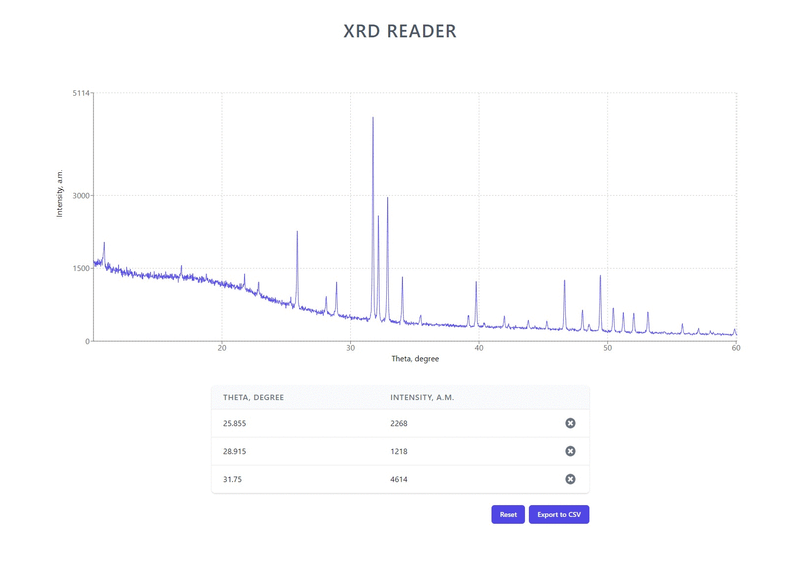

<p align="center">
  <a href="#">
    
  </a>
</p>

<p align="center">
XRD reader is a scientific toolkit for rapid overview XRD data of different materials</p>
<br>

## Project Overview

X-ray diffraction analysis (XRD) is a rapid analytical technique primarily used for investigation of atomic and molecular structure of a crystalline material.

For getting XRD data special diffractometer equipped with proprietary analysis software are used. After analysis a scintist gets data in a tabular format that is not convinient for rapid overview or evaluation of the result, while it is better to do in a graphical view. 

Unfortunately, nowadays there is no convenient free application, which not requires installation for intermediate rapid graph analysis. This toolkit fulfills this gap by providing user-friendly interface for such kind of tasks.


## Preview
<center>
  
</center>


## Main Features & Architectural Notes

- :art: Styled with a utility-first CSS framework - **Tailwind CSS**
- :chart_with_upwards_trend: The graph area visualised with **Recharts** library 
- :atom_symbol: Provides interactive UI with **React**
- :package: Supports "Drag 'n Drop" function
- :eye_speech_bubble: Reads CSV-like XRD-data files
- :heavy_check_mark: Marks measurements on a graphs & exports measured points in CSV format for further analysis


## Getting Started

```bash
git clone https://github.com/felistter/xrd-reader.git
cd xrd-reader 
npx install
npx craco start
```

## License

Licensed under the MIT License.

